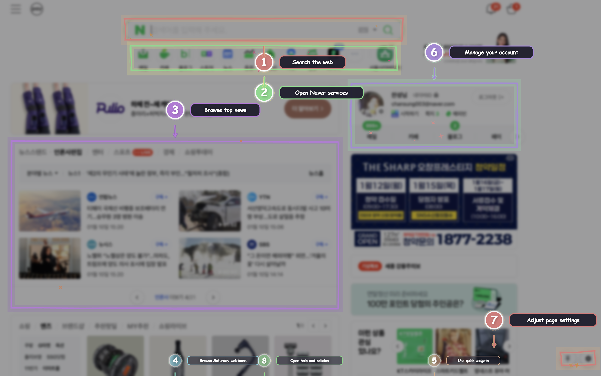
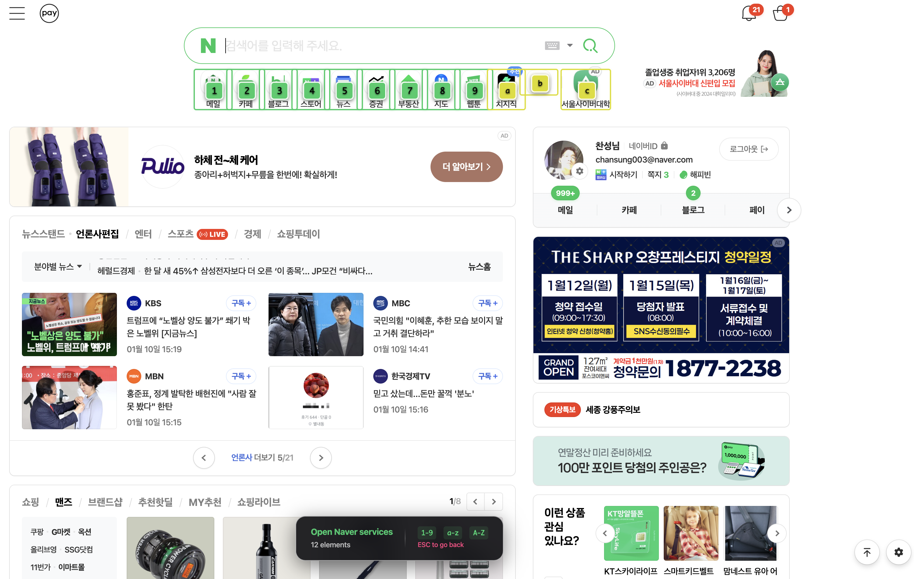

# Building SurfMate: AI-Powered Keyboard Navigation for the Web

## Why I Built SurfMate

### The Frustration

As a software engineer, I spend 8-10 hours a day in my browser - navigating GitHub, reading documentation, managing Jira tickets, reviewing code on GitLab, and hopping between countless web apps. And despite all the advances in web technology, I found myself constantly reaching for my mouse.

I tried existing keyboard navigation tools like Vimium, but they always fell short:
- **They couldn't understand what elements actually did** - I'd see hints like "button #3" but have no idea what it would click
- **They broke on modern web apps** - Heavy JavaScript frameworks and obfuscated CSS classes confused them
- **They lacked context awareness** - A "Submit" button in a login form looks the same as one in a comment section to a heuristic

### The Vision

What if we could use AI to actually *understand* page structure and provide truly intelligent keyboard navigation? Not just "click the third button" but "click the Submit Comment button in the reply form"?

That question led to **SurfMate** - a Chrome extension that uses Large Language Models (OpenAI GPT and Google Gemini) to analyze web pages and provide context-aware, workflow-driven keyboard shortcuts.



*Container-level navigation with semantic grouping*

## Who Is This For?

### Primary Users

**Developers & Power Users**
- Navigate complex web applications (GitHub, GitLab, Jira, Linear, etc.) without touching the mouse
- Faster workflow when reviewing code, managing issues, or browsing documentation

**Accessibility Users**
- Alternative navigation method for users who struggle with mouse precision
- Keyboard-only workflow for users with motor impairments

**Productivity Enthusiasts**
- Anyone who wants to navigate faster and more efficiently
- Users who prefer keyboard shortcuts but find them hard to remember

### Ideal Use Cases

| Use Case | How SurfMate Helps |
|----------|-------------------|
| **Code Review** | Quickly jump between file views, comment sections, and merge buttons |
| **Form Filling** | Navigate through multi-part forms without tabbing through every element |
| **Documentation Browsing** | Jump between sections, code blocks, and navigation links |
| **Admin Panels** | Navigate complex dashboards with many tables, filters, and actions |
| **E-Commerce** | Select products, add to cart, and checkout without mouse |
| **Social Media** | Navigate feeds, like/comment buttons, and profile links |

## How It Works (High-Level)

### Basic Usage

1. **Activate**: Press `Option+Shift+B` (Mac) or `Ctrl+Shift+B` (Windows/Linux)

2. **Choose a Container**: SurfMate shows you semantic containers (1-9):
   - `1` - Navigation menu
   - `2` - Main content area
   - `3` - Sidebar
   - etc.

3. **Select an Element**: Once inside a container, press a letter key (a-z) to select:
   - `a` - "Search repositories..."
   - `b` - "Your notifications"
   - `c` - "New repository"
   - etc.

4. **Go Back**: Press `Escape` to return to container level



*Vimium-style hints within a container with action-oriented labels*

### Key Features

- **Action-Oriented Labels**: Instead of "button #2", you see "Submit comment" or "Search..."
- **Workflow-Aware Ordering**: Input fields appear before submit buttons
- **Smart Grouping**: Related elements are grouped into containers
- **Never Overlapping**: Hints automatically reposition to avoid collisions
- **Multi-Language**: Supports English and Korean labels

### Example Workflow: GitHub PR Review

```
1. Activate SurfMate (Option+Shift+B)
2. Press "2" to enter "Pull request files" container
3. Press "a" to click "Viewed" checkbox
4. Press "b" to open the first file
5. Press "Escape" to go back
6. Press "c" to open the next file
7. Press "d" to add a review comment
8. Press "e" to submit your review
```

No mouse needed - pure keyboard flow at maximum speed.

## Technical Architecture

### The Core Insight

The breakthrough was realizing that LLMs don't just generate text - they can *understand* structure. By sending a DOM snapshot to GPT or Gemini and asking for structured JSON output, we get:

1. **Semantic container detection** - The AI recognizes navigation, main content, sidebars
2. **Meaningful labels** - It reads the surrounding context to describe what elements do
3. **Workflow ordering** - It understands logical interaction patterns

### Why Existing Tools Fall Short

| Limitation | Vimium & similar | SurfMate (AI-powered) |
|------------|------------------|----------------------|
| Element labels | "button[3]" or generic text | "Submit comment" |
| Container detection | Heuristic-based (often wrong) | AI-identified semantic sections |
| Dynamic content | Breaks on SPAs | Re-analyzes on refresh |
| Collision handling | Fixed positions (overlaps) | Smart repositioning |

## The Problem (Technical Deep Dive)

Existing keyboard navigation tools face fundamental limitations:

## The Solution: AI-Powered Analysis

SurfMate takes a different approach. Instead of relying on heuristics, it sends a DOM snapshot to an LLM and asks: *"What are the important interactive elements on this page, and what do they actually do?"*

The result is intelligent navigation with:
- **Action-oriented labels**: "Submit comment" instead of "button #2"
- **Semantic container detection**: Navigation, main content, forms, etc.
- **Workflow-aware ordering**: Input fields come before submit buttons
- **Perfect collision handling**: Hints never overlap


## Architecture

### Two-Level Navigation Model

SurfMate uses a hierarchical navigation model:

```
Level 1: Container Selection (1-9)
  ↓
Level 2: Element Selection within container (a-z)
  ↓
Action: Click/focus the selected element
```

This design choice was deliberate:
- **Reduces cognitive load**: Users only see ~9 containers at a time
- **Enables workflow-aware ordering**: Each container's elements are ordered logically
- **Scales to complex pages**: Even pages with 100+ elements remain navigable

### Extension Structure

```
SurfMate/
├── manifest.json          # Chrome Extension V3 manifest
├── background.js          # Service worker (API calls, caching, queue)
├── content.js            # Content script (DOM analysis, hints, overlay)
├── popup.html/js         # Settings UI
├── styles.css            # Animations and overlay styling
└── icons/                # Extension icons
```

## Technical Deep Dive

### 1. DOM Snapshot Generation

The first challenge was creating a clean, LLM-friendly representation of the page. Raw HTML is too verbose and contains noise (scripts, styles, comments).

```javascript
// Simplified snapshot generation
function generateDOMSnapshot(root) {
  const snapshot = {
    url: window.location.href,
    title: document.title,
    elements: []
  };

  function processNode(node, depth = 0) {
    if (depth > 10) return; // Limit depth

    // Get semantic info
    const tagName = node.tagName?.toLowerCase();
    const isInteractive = INTERACTIVE_TAGS.has(tagName) ||
                         node.onclick !== null ||
                         node.tabIndex >= 0;

    if (isInteractive && isVisible(node)) {
      snapshot.elements.push({
        tagName,
        id: node.id || null,
        className: node.className || null,
        textContent: node.textContent?.trim().substring(0, 50) || null,
        attributes: getImportantAttributes(node),
        selector: generateSelector(node), // Critical for later interaction
        position: getRelativePosition(node)
      });
    }

    // Recursively process children
    for (const child of node.children) {
      processNode(child, depth + 1);
    }
  }

  processNode(document.body);
  return snapshot;
}
```

**Key design decisions:**
- **Text truncation**: Limit textContent to 50 chars to reduce token usage
- **Selector generation**: Store exact CSS selectors for later element interaction
- **Position tracking**: Store relative positions for visual hint placement
- **Visibility check**: Filter out hidden elements to reduce noise

### 2. AI Integration with Multiple Providers

SurfMate supports both OpenAI and Google Gemini with provider-specific handling:

```javascript
// Provider-specific API calls
async function handleAnalyzePage(message, cacheKey) {
  const { domSnapshot, url, title } = message;

  // Check cache first
  const cached = pageCache.get(cacheKey);
  if (cached && Date.now() - cached.timestamp < CACHE_DURATION) {
    return cached.data;
  }

  // Route to appropriate provider
  if (provider === 'gemini') {
    return handleAnalyzePageGemini(message, cacheKey);
  }
  return handleAnalyzePageOpenAI(message, cacheKey);
}
```

**OpenAI Integration:**

```javascript
async function handleAnalyzePageOpenAI(message, cacheKey) {
  const requestBody = {
    model: model,
    messages: [
      {
        role: 'system',
        content: `You are a web page navigation assistant...`
      },
      {
        role: 'user',
        content: `Page URL: ${url}\nPage Title: ${title}\n\nDOM Snapshot:\n${JSON.stringify(domSnapshot, null, 2)}`
      }
    ],
    max_completion_tokens: 8192,
    temperature: 0.1,
    response_format: { type: 'json_object' }
  };

  const response = await fetch('https://api.openai.com/v1/chat/completions', {
    method: 'POST',
    headers: {
      'Content-Type': 'application/json',
      'Authorization': `Bearer ${getApiKey()}`
    },
    body: JSON.stringify(requestBody)
  });

  const data = await response.json();
  const content = data.choices?.[0]?.message?.content;
  return JSON.parse(content);
}
```

**Gemini Integration with Structured Output:**

```javascript
async function handleAnalyzePageGemini(message, cacheKey) {
  const requestBody = {
    contents: [{
      parts: [{ text: systemPrompt + '\n\n' + userPrompt }]
    }],
    generationConfig: {
      temperature: 0.1,
      maxOutputTokens: 8192,
      responseMimeType: 'application/json',
      thinkingConfig: {
        thinkingBudget: 0  // Disable thinking mode for faster responses
      },
      responseSchema: {
        type: 'object',
        properties: {
          containers: {
            type: 'array',
            items: {
              type: 'object',
              properties: {
                selector: { type: 'string' },
                label: { type: 'string' },
                type: { type: 'string' }
              },
              required: ['selector', 'label', 'type']
            }
          },
          standalone: {
            type: 'array',
            items: {
              type: 'object',
              properties: {
                selector: { type: 'string' },
                label: { type: 'string' },
                type: { type: 'string' }
              },
              required: ['selector', 'label', 'type']
            }
          }
        }
      }
    }
  };

  const response = await fetch(
    `https://generativelanguage.googleapis.com/v1beta/models/${model}:generateContent?key=${getApiKey()}`,
    { method: 'POST', headers: { 'Content-Type': 'application/json' }, body: JSON.stringify(requestBody) }
  );

  const data = await response.json();
  const content = data.candidates?.[0]?.content?.parts?.[0]?.text;
  return JSON.parse(content);
}
```

**Structured Output Benefits:**
- Reliable JSON parsing (no markdown wrapping issues)
- Type safety with enums for element types
- Better error messages when schema is violated
- Reduced token usage (model doesn't need to explain format)

### 3. Request Queue & Rate Limiting

One critical issue I encountered was rate limiting with Gemini API. The extension makes multiple parallel requests (page analysis + container analyses), which triggered 429 errors.

**Solution: Sequential Request Queue**

```javascript
// Queue to prevent rate limiting
let apiQueue = Promise.resolve();
const REQUEST_DELAY = 500; // 500ms between requests

async function queueRequest(requestFn) {
  const previousQueue = apiQueue;
  apiQueue = previousQueue.then(async () => {
    const result = await requestFn();
    // Add delay between requests for Gemini
    if (provider === 'gemini') {
      await new Promise(resolve => setTimeout(resolve, REQUEST_DELAY));
    }
    return result;
  });
  return apiQueue;
}

// Usage
chrome.runtime.onMessage.addListener((message, sender, sendResponse) => {
  if (message.type === 'analyzePage') {
    queueRequest(() => handleAnalyzePage(message))
      .then(sendResponse)
      .catch(error => sendResponse({ error: error.message }));
    return true; // Keep message channel open
  }
});
```

**Retry Logic with Exponential Backoff:**

```javascript
async function fetchWithRetry(url, options, maxRetries = 3) {
  for (let attempt = 0; attempt < maxRetries; attempt++) {
    const response = await fetch(url, options);

    if (response.status !== 429) {
      return response;
    }

    if (attempt === maxRetries - 1) {
      throw new Error('Rate limit exceeded');
    }

    // Exponential backoff: 1s, 2s, 4s
    const delayMs = Math.pow(2, attempt) * 1000;
    console.log(`Rate limited (429), retrying in ${delayMs}ms...`);
    await new Promise(resolve => setTimeout(resolve, delayMs));
  }
}
```

### 4. Selector Generation & Handling

One of the trickiest parts was generating reliable CSS selectors that work on dynamic sites.

**Challenge: Tailwind CSS Hash Classes**

```html
<!-- Tailwind generates random hash classes -->
<button class="bg-blue-500 hover:bg-blue-700 text-white font-bold py-2 px-4 rounded-[0.25rem]">
```

**Solution: Smart Selector Generation**

```javascript
function generateSelector(element) {
  // Try ID first (most reliable)
  if (element.id) {
    return `#${CSS.escape(element.id)}`;
  }

  // Try unique class names
  const classes = element.className?.split(/\s+/).filter(c => c && !c.startsWith('['));
  if (classes?.length === 1) {
    const selector = `.${CSS.escape(classes[0])}`;
    if (document.querySelectorAll(selector).length === 1) {
      return selector;
    }
  }

  // Use tag + nth-child as fallback
  const parent = element.parentElement;
  const siblings = Array.from(parent.children);
  const index = siblings.indexOf(element);
  const parentSelector = generateSelector(parent);
  return `${parentSelector} > ${element.tagName.toLowerCase()}:nth-child(${index + 1})`;
}
```

**Handling Special Characters:**

```javascript
// CSS.escape() handles special characters like:
// - Colons in Tailwind arbitrary values: rounded-[0.25rem]
// - Spaces in class names: "my class"
// - Special chars: . # : [ ] ( ) etc.
const safeSelector = `.${CSS.escape(className)}`;
```

### 5. Collision Detection & Hint Positioning

To ensure hints never overlap, I implemented a 9-position trial algorithm:

```javascript
function findBestPosition(element, existingHints) {
  const rect = element.getBoundingClientRect();
  const positions = [
    { x: rect.left + rect.width / 2, y: rect.top + rect.height / 2 },       // Center
    { x: rect.left + rect.width / 2, y: rect.top - 20 },                    // Top center
    { x: rect.left + rect.width / 2, y: rect.bottom + 20 },                 // Bottom center
    { x: rect.left - 20, y: rect.top + rect.height / 2 },                   // Left center
    { x: rect.right + 20, y: rect.top + rect.height / 2 },                  // Right center
    { x: rect.left - 10, y: rect.top - 10 },                                 // Top left
    { x: rect.right + 10, y: rect.top - 10 },                                // Top right
    { x: rect.left - 10, y: rect.bottom + 10 },                              // Bottom left
    { x: rect.right + 10, y: rect.bottom + 10 }                              // Bottom right
  ];

  for (const pos of positions) {
    if (!checkCollision(pos, existingHints)) {
      return pos; // Found a non-colliding position
    }
  }

  // All positions collide, return center as fallback
  return positions[0];
}

function checkCollision(pos, existingHints) {
  const HINT_SIZE = 30;
  for (const hint of existingHints) {
    const dx = pos.x - hint.x;
    const dy = pos.y - hint.y;
    const distance = Math.sqrt(dx * dx + dy * dy);
    if (distance < HINT_SIZE + 10) { // +10 for margin
      return true;
    }
  }
  return false;
}
```

### 6. Hand-Drawn Aesthetic & Animations

The visual design uses SVG filters and CSS animations to create a hand-drawn, doodle-like appearance:

```css
/* Hand-drawn border effect */
.browse-hint-border {
  stroke: #00E676;
  stroke-width: 2;
  stroke-linecap: round;
  stroke-linejoin: round;
  filter: url(#sketchy); /* SVG turbulence filter */
}

/* Dynamic sparkle animations */
@keyframes sparkleBurst {
  0% {
    opacity: 0;
    transform: scale(0) rotate(0deg);
  }
  40% {
    opacity: 1;
    transform: scale(2.5) rotate(120deg);
    filter: brightness(3) saturate(2);
    box-shadow:
      0 0 25px rgba(255, 255, 255, 1),
      0 0 50px rgba(0, 230, 118, 0.8),
      0 0 75px rgba(255, 235, 59, 0.6),
      0 0 100px rgba(255, 64, 129, 0.4);
  }
  100% {
    opacity: 0;
    transform: scale(0.3) rotate(300deg);
  }
}
```

## Challenges & Solutions

### Challenge 1: Token Limits & Truncated Responses

**Problem**: Gemini API has a maxOutputTokens limit. Large pages with many elements caused truncated JSON responses.

**Solution**:
- Increased token limits (8192 for pages, 4096 for containers)
- Added `finishReason` check to detect truncation
- Implemented better error messages

```javascript
const finishReason = data.candidates?.[0]?.finishReason;
if (finishReason === 'MAX_TOKENS') {
  throw new Error('Response too large - try reducing page complexity');
}
```

### Challenge 2: API Key Management for Multiple Providers

**Problem**: Users need separate API keys for OpenAI and Gemini.

**Solution**: Separate storage and UI inputs

```javascript
// Separate storage
chrome.storage.local.set({
  openaiApiKey: 'sk-...',
  geminiApiKey: 'AIzaSy...',
  provider: 'openai' // or 'gemini'
});

// Get current API key based on provider
function getApiKey() {
  return provider === 'gemini' ? geminiApiKey : openaiApiKey;
}
```

### Challenge 3: DOM Mutation Handling

**Problem**: SPAs dynamically update the DOM, making cached selectors invalid.

**Solution** (partial):
- 5-minute cache TTL
- Manual refresh (`R` key) to re-analyze
- Future: MutationObserver for automatic re-analysis

## Performance Optimizations

1. **Caching**: Page analyses cached for 5 minutes with provider+model in cache key
   ```javascript
   const cacheKey = `${url}|container|${containerLabel}|${provider}|${model}`;
   ```

2. **Sequential Requests**: Prevents parallel API calls that trigger rate limits

3. **Debounced Input**: API key input saved after 500ms of inactivity

4. **Structured Output**: Reduces token usage vs text-based JSON schemas

## What's Next?

- [ ] **Help Modal**: Full keyboard reference with examples
- [ ] **Customizable Shortcuts**: Let users remap keys
- [ ] **Session Persistence**: Remember navigation state across pages
- [ ] **Visual History**: Show recently visited elements
- [ ] **Export/Import Settings**: Backup configuration
- [ ] **MutationObserver**: Auto-detect DOM changes and re-analyze

## Conclusion

Building SurfMate taught me a lot about Chrome Extension development, AI integration, and the challenges of web automation. The key insight was that AI can dramatically improve user experience when used to understand semantics, not just generate text.

The two-level navigation model, combined with intelligent labeling and perfect collision handling, creates a keyboard navigation experience that feels magical. Press a few keys, and you're exactly where you want to be - no mouse required.

If you're interested in trying it out or contributing, check out the [GitHub repo](https://github.com/deep-diver/SurfMate). Feedback and pull requests are welcome!

---

**Built with ❤️ using OpenAI GPT and Google Gemini**
